## 项目概述

### 项目名称

NYC Urban Operations Intelligence Platform (NYC-UOIP)

### 仓库架构

[项目包结构规划](./docs/nyc-uoip-repo-structure.html)

### 项目定位

这是一个模拟真实商业场景驱动的数据平台项目。

目标是模拟纽约市 (New York City) 城市运营团队（例如：311 调度中心、交通管理部门、应急响应调度组）的数据团队，构建一个**城市运营智能平台（Urban Operations Intelligence Platform）**。通过整合海量、稳定的政府公开 API 与气象数据，预测未来24小时各大区/社区的运营负荷水平，并为城市公共资源（急救、市政维修、客服座席等）配置提供决策建议。

项目重点：

- Data Engineering
- Lakehouse Architecture
- Spark ETL
- BigQuery Data Warehouse
- Airflow Orchestration (Incremental Ingestion)
- Operational Intelligence System

不以机器学习为核心，而以大规模数据平台建设、增量数据流转和决策支持系统为核心。

### 商业背景

NYC 311 呼叫中心及应急调度部门拥有有限的服务与巡逻资源。

每天需要回答：

- 哪些行政区 (Borough) 或社区未来24小时**服务请求和突发事件的负荷最高**？
- 负荷上升的主要原因是什么（如：暴雪引发供暖投诉、恶劣天气导致交通事故激增）？
- 如何跨部门优化资源配置（例如：提前增派铲雪车、增加311热线供暖组接线员、在事故高发路段增派救护车）？

目前数据分散在不同的 Socrata 端点和气象系统中，缺少统一的数据平台和自动化评估机制。 因此需要建设一个统一的 Lakehouse 平台和运营评分系统。

### 核心商业目标

系统每天自动生成：

**1. Operational Load Score (运营负荷分)**

示例：

|Borough|Operational Load Score|
|---|---|
|Brooklyn|87|
|Manhattan|75|
|Queens|42|

用于识别未来24小时高运营负荷区域。

**2. Operational Drivers (驱动因素)**

解释高负荷来源： 例如： **Brooklyn:**

- Severe Weather Impact (Blizzard / 暴雪)
- High Volume 311 Heating Complaints (大量 311 供暖中断投诉)
- Historical Traffic Collision Pattern (历史交通事故高发区)

**3. Resource Allocation Recommendation (资源配置建议)**

根据负荷自动给出跨部门资源建议： 示例： **Increase Deployment:**

- **311 Call Center:** +15% agents for Heating/Housing queue in Brooklyn.
- **Traffic/EMS:** +3 standby ambulances in Manhattan cross-streets.

**Reduce Deployment:**

- **Parks Dept:** -2 regular inspection teams in Queens (due to snow).

目标是辅助城市应急与市政服务的宏观部署决策。

### 数据来源（必须真实、公开、稳定可获得）

**Dataset 1 — NYC 311 Service Requests**

- **端点：** `https://data.cityofnewyork.us/resource/erm2-nwe9.json` (Socrata API)
- **字段：** `created_date`, `complaint_type`, `descriptor`, `incident_zip`, `borough`, `latitude`, `longitude`, `status`
- **用途：** 核心事实表（市政服务负荷）。支持按天增量拉取。

**Dataset 2 — NYPD Motor Vehicle Collisions**

- **端点：** `https://data.cityofnewyork.us/resource/h9gi-nx95.json` (Socrata API)
- **字段：** `crash_date`, `crash_time`, `borough`, `latitude`, `longitude`, `number_of_persons_injured`, `contributing_factor_vehicle_1`
- **用途：** 核心事实表（交通与急救负荷）。支持按天增量拉取。

**Dataset 3 — Open-Meteo Weather Data**

- **端点：** `https://api.open-meteo.com/v1/forecast` (开源 API，免鉴权)
- **字段：** `time`, `temperature_2m`, `snowfall`, `precipitation`, `windspeed_10m`
- **用途：** 运营负荷的环境影响因素（天气预报与历史快照）。

**Dataset 4 — NYC Borough Boundaries (静态空间数据)**

- **端点：** NYC Open Data (GeoJSON 导出)
- **字段：** `boro_code`, `boro_name`, `geometry` (多边形)
- **用途：** 地理空间聚合（用于 BigQuery `ST_CONTAINS` 计算缺失经纬度的工单归属）。

### 需求范围（MVP）

MVP 不做复杂 AI，采用规则引擎即可。

**Operational Load Score：** Score = 0.4 × 311 Request Volume Factor + 0.4 × Vehicle Collision Factor + 0.2 × Weather Factor

输出：

- 区域运营负荷排名
- 负荷原因分析
- 资源配置建议

### 系统架构

采用 Lakehouse Architecture。

Data Sources (Socrata/Open-Meteo APIs) ↓ Ingestion Layer (Airflow Incremental Pull via Python) ↓ GCS Bronze (Raw JSON/GeoJSON partitioned by execution_date) ↓ Spark ETL (Dataproc - Schema Enforcement, Deduplication, Cleaning) ↓ Silver Layer (Parquet) ↓ BigQuery Gold Layer (Star Schema, ST_GEOG functions) ↓ Operational Intelligence Engine (SQL based rules) ↓ Recommendation Engine ↓ Dashboard / Reporting

### 数据分层

**Bronze** 原始数据 特点：Immutable, Raw JSON / GeoJSON, 按调度时间严格分区保存历史快照。

**Silver** 清洗数据 包含：Schema Validation, Timestamp Standardization, Data Quality Checks (处理 Socrata 延迟到达的数据), Deduplication。

**Gold** 业务层 包含：Operational Metrics, Spatial Aggregated Tables, Reporting Tables。

### 数据仓库设计

**Fact Tables：**

- `fact_311_requests`
- `fact_vehicle_collisions`

**Dimension Tables：**

- `dim_date`
- `dim_weather`
- `dim_geography` (Borough/NTA 空间维度表)

**采用：**

- Star Schema
- BigQuery Partitioning (By Date)
- BigQuery Clustering (By Spatial / Borough / Complaint Type)

### 技术栈

- **Cloud:** GCP
- **Storage:** Google Cloud Storage (GCS)
- **Processing:** Spark, Dataproc
- **Warehouse:** BigQuery
- **Orchestration:** Airflow / Cloud Composer
- **Visualization:** Looker Studio / Streamlit（可选）
- **Language:** Python, SQL

### 敏捷开发路线

**Phase 1: Data Ingestion Foundation** 目标：建立数据湖，打通 Socrata/Meteo API 增量拉取。 交付：GCS Bucket, Airflow DAGs (含分页处理与增量逻辑), Architecture Diagram。

**Phase 2: Spark ETL Layer** 目标：构建 Bronze → Silver。 交付：Spark Jobs, Data Cleaning Pipeline (处理脏数据与空值), Deduplication Logic。

**Phase 3: Warehouse Modeling** 目标：构建 Gold Layer。 交付：Star Schema, BigQuery Tables, Spatial (GIS) Analytical Views。

**Phase 4: Operational Intelligence Engine** 目标：生成 Operational Load Score。 交付：SQL Calculation Logic, Load Ranking Tables, Load Driver Analysis。

**Phase 5: Resource Recommendation Engine** 目标：生成资源配置建议。 交付：Recommendation Rules, Resource Allocation Outputs。

### Agent 工作原则

当讨论本项目时：

- 优先采用企业级数据工程最佳实践（如：处理 Socrata API 分页、处理 Late-arriving facts）。
- 以真实生产系统为标准。
- 不以学习演示为目标。
- 所有设计应考虑可扩展性、可维护性和成本控制。
- 优先关注 Data Engineering、Lakehouse、BigQuery (特别是 GIS 空间计算)、Spark、Airflow 相关能力。
- 默认采用敏捷开发模式，逐阶段交付 MVP。
- 所有设计决策需要解释业务价值与技术价值。