# NYC Urban Operations Intelligence Platform

**[Chinese (中文)](./README_zh.md)**

---

## Overview

NYC-UOIP is a production-grade Lakehouse pipeline that ingests NYC Open Data (311 requests, NYPD collisions, weather) and produces daily **Operational Load Scores** with resource allocation recommendations per borough.

> **What does this mean?** Imagine a city's 311 call center needing to predict: "Where will service requests spike tomorrow? Which boroughs need more ambulances? Should we add more heating complaint operators before a snowstorm?" This platform answers those questions automatically.

### Architecture

```
Data Sources (Socrata / Open-Meteo APIs)
         ↓
Ingestion Layer (Airflow - incremental pull)
         ↓
Bronze Layer  →  Silver Layer  →  Gold Layer
(Raw JSON)       (Parquet)        (BigQuery / Iceberg)
                                     ↓
                          Operational Intelligence Engine
                                     ↓
                          Dashboard / Recommendations
```

### Package Structure

```
nyc-uoip/
├── ingestion/           # API clients & loaders
│   ├── clients/         # Socrata, Open-Meteo wrappers
│   ├── loaders/         # GCS / MinIO bronze writers
│   └── schemas/         # Pydantic validation models
├── spark/               # PySpark ETL jobs
│   ├── jobs/            # Entry points (one per dataset)
│   ├── transforms/      # Reusable transform functions
│   └── schemas/         # Silver layer StructType definitions
├── sql/
│   ├── ddl/             # CREATE TABLE statements
│   ├── dml/             # Incremental MERGE/INSERT
│   └── intelligence/    # Load score & recommendation SQL
├── dags/                # Airflow DAG definitions (scheduling only)
├── contracts/           # Source registry & data contracts
├── infra/
│   ├── terraform/       # GCP resources (Phase 1)
│   └── docker/          # Self-hosted stack (Phase 2)
└── tests/
    ├── unit/            # Python unit tests (no Spark/cloud)
    └── fixtures/        # Mock API responses
```

### Data Sources

| Dataset | Source | Key Fields |
|---------|--------|------------|
| NYC 311 Requests | Socrata API | created_date, complaint_type, borough, location |
| NYPD Collisions | Socrata API | crash_date, borough, injuries, contributing factors |
| Weather | Open-Meteo API | temperature, snowfall, precipitation, wind |
| Borough Boundaries | NYC Open Data (GeoJSON) | geometry polygons for spatial joins |

### Data Layers

| Layer | Format | Description |
|-------|--------|-------------|
| **Bronze** | Raw JSON/GeoJSON | Immutable historical snapshots, partitioned by date |
| **Silver** | Parquet | Cleaned, validated, deduplicated |
| **Gold** | BigQuery / Iceberg | Star schema, spatial analytics, load scores |

### Core Deliverables

1. **Operational Load Score** — Predicts 24h service demand per borough (0-100 scale)
2. **Driver Analysis** — Explains *why* a borough has high load (weather impact, 311 volume, collision patterns)
3. **Resource Recommendations** — Actionable suggestions (e.g., "+15% agents for heating queue in Brooklyn")

### Two-Phase Delivery

| Phase | Stack | Use Case |
|-------|-------|----------|
| **Phase 1** | GCP (GCS + Dataproc + BigQuery + Cloud Composer) | Cloud-native enterprise deployment |
| **Phase 2** | Self-hosted (MinIO + Spark + Iceberg + Trino + Docker Airflow) | Local development / on-prem |

Switch via `DEPLOYMENT_PHASE=1` or `DEPLOYMENT_PHASE=2` env var.

### Quick Start

```bash
# Install dependencies
make install

# Lint & test
make lint
make test-unit

# Submit a Spark job locally (Phase 2)
make spark-submit JOB=spark/jobs/etl_nyc_311.py

# Bring up Phase 2 Docker stack
docker compose -f infra/docker/docker-compose.yml up -d
```

### Key Conventions

- **ETL jobs are idempotent** — re-running the same `execution_date` produces identical output
- **DAGs contain scheduling logic only** — all business logic lives in `ingestion/` or `spark/`
- **All timestamps are UTC** — use `timestamp_normalizer.py` for conversions
- **No `SELECT *` in Gold SQL** — explicit column lists only