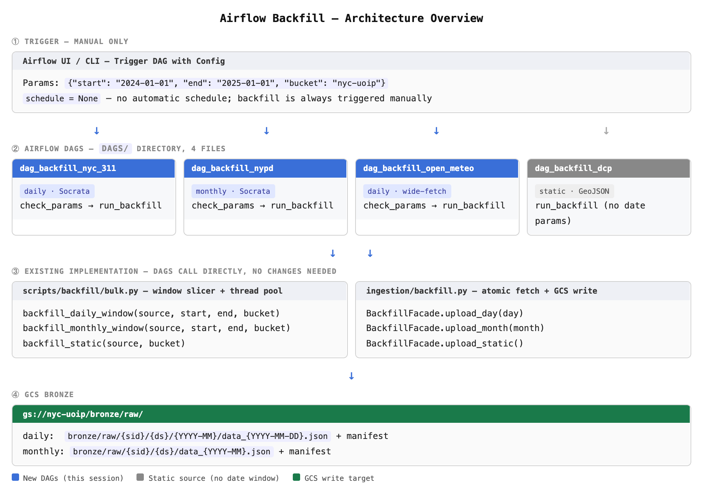

### 启动
```shell
# 相当于 `cd infra/terraform && terraform apply`
make terraform-apply

# 3. 等创建完成后，部署代码
make deploy-composer

# 4. 浏览器打开 Airflow UI
terraform -chdir=infra/terraform output composer_airflow_uri
```

#### Airflow是如何部署到Composer的
Composer 2 的 Worker Pod 已经预装了 Python 3.x + Airflow。业务代码（ingestion/、scripts/、config/）通过 gsutil rsync 放到 plugins/ 目录，Composer 自动把它加到 PYTHONPATH，等价于你在本地 export PYTHONPATH=. 然后跑脚本。

```shell
airflow tasks run dag_backfill_nyc_311 run_backfill 2024-01-01
  └─ Airflow 在 Worker Pod 里 import DAG 文件
  └─ 找到对应 Task，执行 callable（如 PythonOperator 的 python_callable）
  └─ callable 里 from ingestion.backfill import BackfillFacade ← 从 plugins/ 目录 import
  └─ 直接调用 Python 函数
```

> 代码通过 `gsutil rsync` 上传到composer实例，每次执行rsync命令只上传有变更的文件

|方式|Composer 用吗|适合场景|
|---|---|---|
|直接 import Python 文件|✅ 就是这个|纯 Python 任务、小中型 ETL|
|DockerOperator / KubernetesPodOperator|可以选用|依赖复杂、需隔离环境|
|打包 wheel 安装|可以选用|大型项目、有 C 扩展依赖|

### Airflow 核心概念速通（Java 视角）

|Airflow 概念|Java 类比|本项目对应|
|---|---|---|
|**DAG**|一个 `@Configuration` 类，定义任务流|`dag_backfill_nyc_311.py`|
|**Task / Operator**|一个 `@Bean` 方法，定义一个工作单元|`PythonOperator` 调用 `backfill_daily_window`|
|**DAG Run**|一次任务执行实例（带时间戳）|你手动触发一次 = 一次 Run|
|**Params**|运行时注入的参数（类似 Spring `@Value`）|`start=2024-01-01, end=2025-01-01`|
|**XCom**|任务间传值的消息总线|本项目暂不需要|
|**schedule**|Cron 表达式|backfill 场景设为 `None`（纯手动）|

关键认知：**Airflow 本身不执行业务逻辑**——它只是一个任务调度器。我们已有的 `bulk.py` 才是干活的，DAG 只是"触发器 + 监控面板"。

