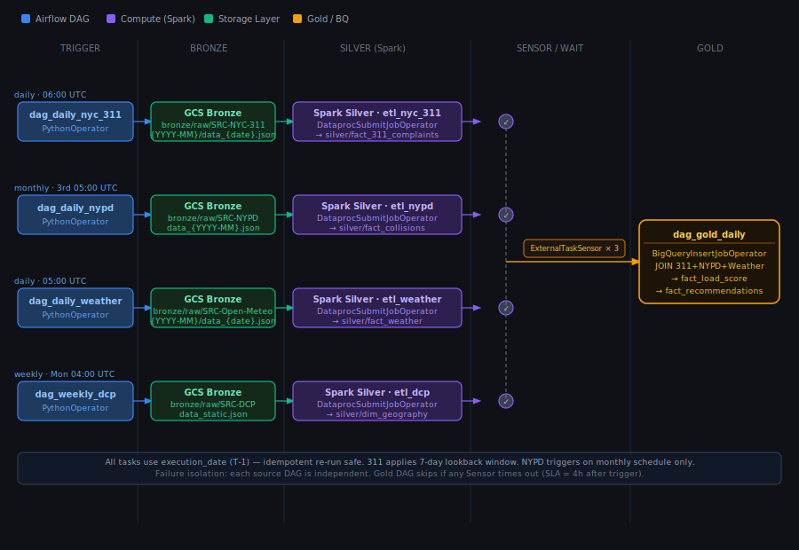

### 如何做增量？

纵切


```text
Airflow Scheduler
    ↓ 发指令
Airflow Worker（轻量）
    ├─ BronzeTask → 直接在 Worker 上跑（Python HTTP 调用，很轻）
    ├─ SilverTask → 提交 job 给 Dataproc，然后等结果
    └─ GoldTask   → 提交 SQL 给 BigQuery，然后等结果
         ↑                    ↑
      Dataproc             BigQuery
   （真正跑 Spark）      （真正跑 SQL）
```

### 各层真实执行者（Phase 1 GCP）

|层|任务类型|真实执行者|Airflow Operator|
|---|---|---|---|
|Bronze|Python HTTP 调用 API|**Airflow Worker VM**|`PythonOperator`|
|Silver|PySpark 清洗转换|**Dataproc 集群**|`DataprocSubmitJobOperator`|
|Gold|BigQuery SQL|**BigQuery 无服务器**|`BigQueryInsertJobOperator`|

---