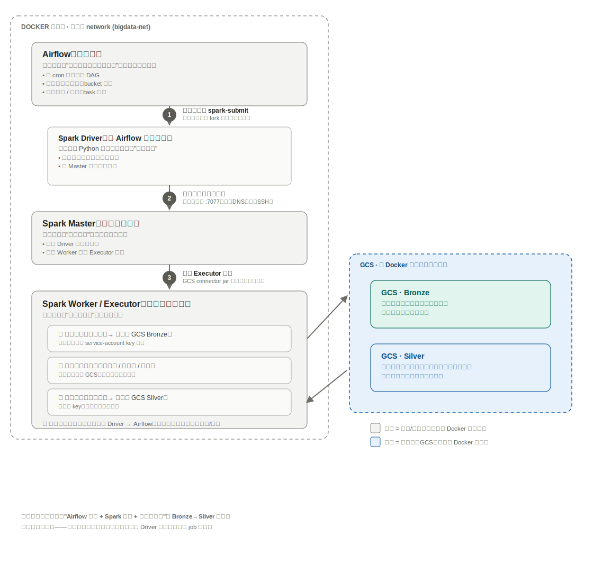

# Silver 层执行架构：Airflow + Spark + GCS 怎么跑通 to-Silver

> 承接 [week3-Build_Silver_Layer.md](week3-Build_Silver_Layer.md)——那篇讲"清洗规则怎么定"，
> 这篇讲"job 怎么真正跑起来"：触发链路、各组件职责边界、为什么从 Dataproc 切到自建 Docker Spark。
> 以 `SRC-Open-Meteo` 的 `spark/jobs/etl_open_meteo.py` 为例，但这套架构能跑通任何
> "Airflow 调度 + Spark 处理 + 云存储落地"的 Bronze → Silver 任务，不局限于某一个数据集。

---

## 0. 一张图看懂职责边界 + 执行链路



---

## 1. 核心结论：谁来做、在哪个容器里跑

这是最容易混淆的一张表——**Airflow 只负责前两行，剩下全部是 Spark 的事**：

| 阶段 | 谁来做 | 在哪个容器里跑 |
|---|---|---|
| 调度 / 触发 / 重试 / 告警 | Airflow | `airflow-scheduler` |
| 发起 `spark-submit` 命令 | Airflow（`SparkSubmitOperator`） | `airflow-scheduler` |
| Driver：解析执行计划、协调任务 | Spark | `airflow-scheduler`（client 模式下 driver 进程跑在这里） |
| 实际读 GCS Bronze NDJSON | Spark Executor | `spark-worker` |
| 去重 / 时区转换 / 范围校验 | Spark Executor（Catalyst 执行计划） | `spark-worker` |
| 实际写 GCS Silver Parquet | Spark Executor | `spark-worker` |

**这张表里最反直觉的一点**：Spark **Driver** 进程并不是跑在 `spark-master` 容器里，而是跑在 **Airflow 的 `airflow-scheduler` 容器**里——因为我们用的是 `deploy-mode=client`。`SparkSubmitOperator` 本质上就是在 Airflow 进程里 fork 一个 `spark-submit` 子进程；这个子进程本身就是 Driver，它只是"向外"连接 `spark-master:7077` 申请资源，并不需要自己换一个容器去跑。

真正离开 Airflow 容器、跑到别的机器（`spark-worker`）上去的，只有 **Executor** 进程——也只有 Executor 会真正碰到数据（读 Bronze、做转换、写 Silver）。Airflow 和 Driver 全程不 import `pandas`，不读一行记录。

---

## 2. 五个角色的职责说明

| 组件 | 跑在哪 | 一句话职责 | 不负责什么 |
|---|---|---|---|
| **Airflow**（scheduler/webserver/dag-processor） | `airflow-scheduler` 等容器 | 按 cron 定时触发、渲染参数、失败重试/告警 | 不读不写任何数据，不知道 schema 是什么 |
| **Spark Driver** | 跟 Airflow 同一个 `airflow-scheduler` 容器（client 模式） | 把 [spark/jobs/etl_open_meteo.py](../../../spark/jobs/etl_open_meteo.py) 里的 Python DataFrame 代码编译成执行计划，向 Master 申请资源 | 不直接处理数据，只做编排 |
| **Spark Master** | `spark-master` 容器 | 资源协调者，决定"分配哪个 Worker 接这个活" | 自己不执行任何 task |
| **Spark Worker / Executor** | `spark-worker` 容器 | 真正执行——读取、清洗转换、写出，所有数据都经过这里 | 不知道这个 job 是为了"天气"还是"311"，只管执行 Driver 发来的执行计划 |
| **GCS（Bronze / Silver）** | Docker 网络之外的云存储 | 持久化存储，Bronze 只读不可改，Silver 是清洗后结果 | 不参与任何计算 |

---

## 3. 触发后的完整执行链路（对应架构图里的 ①-⑦）

1. **Airflow 触发 + 渲染参数**：DAG（[dags/dag_silver_open_meteo.py](../../../dags/dag_silver_open_meteo.py)）到点触发，`SparkSubmitOperator` 把 Jinja 模板（执行日期、bucket）渲染成具体值，在 `airflow-scheduler` 容器里 fork 一个子进程执行：
   ```bash
   spark-submit --master spark://spark-master:7077 --deploy-mode client \
                --jars https://storage.googleapis.com/hadoop-lib/gcs/gcs-connector-hadoop3-2.2.21-shaded.jar \
                --conf spark.hadoop.google.cloud.auth.service.account.json.keyfile=/opt/airflow/keys/nyc-uoip-sa-key.json \
                /opt/airflow/plugins/spark/jobs/etl_open_meteo.py --bucket <bucket> --execution-date <date>
   ```
2. **Driver 向 Master 注册，申请资源**：这个子进程就是 Driver，通过 `bigdata-net` 这个 Docker network，靠容器名 `spark-master` 直接解析到 IP，走 TCP 7077 — **不需要 SSH，不需要暴露宿主机端口**，纯粹是同一个 Docker network 里的容器间通信。
3. **Master 在 Worker 上拉起 Executor**：`--jars` 指定的 GCS connector jar 会在这一步分发给 Executor。

   > **踩坑记录**：最初用的是 `--packages com.google.cloud.bigdataoss:gcs-connector:hadoop3-2.2.21`（未 shade 版本）。这个写法会拉一整套自己的传递依赖（Guava 32.1.2、gRPC、protobuf 等近 90 个 jar），版本跟 Spark 自带的 Hadoop client 内置的旧版 Guava 冲突，运行时报
   > `java.lang.NoSuchMethodError: 'void com.google.common.base.Preconditions.checkState(boolean, java.lang.String, long)'`。
   > 解法是换成 Google 官方发布的**已 shade**（所有依赖被重定位到自己的包名下，不会跟 classpath 上任何已有的库冲突）的 fat jar，用 `--jars` 而不是 `--packages` 引入——见 [dags/_spark_common.py](../../../dags/_spark_common.py) 里的 `GCS_CONNECTOR_JAR`。
4. **Executor 并行读 Bronze**：`spark.read.schema(WEATHER_RAW_SCHEMA).json(paths)`（[etl_open_meteo.py](../../../spark/jobs/etl_open_meteo.py)）——这一步发生在 `spark-worker` 容器里，靠挂载进容器的 service-account key 完成 GCS 认证。
5. **内存中清洗转换**：[spark/transforms/weather.py](../../../spark/transforms/weather.py) 里的 `dedupe_by_freshness`（去重）→ `normalize_timestamps`（时区转 UTC）→ `split_by_validity`（范围校验）→ `enforce_schema`（强制对齐 `WEATHER_SILVER_SCHEMA`）。这些全部是 DataFrame 算子（`F.col`/`Window`），不是 Python UDF，所以会被编译进 Spark 执行计划本身，Executor 不需要额外 import 任何项目代码。
6. **写出 Silver**：`valid.write.partitionBy("date").mode("overwrite")...parquet(...)`，`partitionOverwriteMode=dynamic` 只覆盖涉及的分区，保证同一个 `execution_date` 重跑是幂等的。
7. **结果回传 + 审计**：Driver 统计写入行数，低于基线（如 weather 的 `MIN_EXPECTED_ROWS_PER_DAY`）就 `raise RuntimeError`，Airflow 任务标红，触发 `DEFAULT_ARGS` 里配置的重试（3 次）和告警。

---

## 4. 为什么从 Dataproc 切到自建 Docker Spark

- **不变的部分**：Bronze/Silver 仍然在 GCS，存储层完全没动。
- **变的部分**：只是计算引擎从 GCP Dataproc 集群换成了已经在 Ubuntu 服务器上跑的 Spark Standalone 集群（`spark-master`/`spark-worker`，镶在同一个 `bigdata-net` 网络）。
- **取舍**：放弃了 Dataproc 的按需扩缩容和托管运维，换来不用为 GCP 算力付费、复用现有自建大数据栈（Hadoop/Hive/Trino 都已经在同一台机器上）。
- **关键基础设施改动**：
  - [infra/docker/Dockerfile.airflow](../../../infra/docker/Dockerfile.airflow)：给 Airflow 镜像装 OpenJDK + `pyspark` + `apache-airflow-providers-apache-spark`，这样 Airflow 容器自带 `spark-submit` 客户端。
  - [infra/docker/docker-compose.yml](../../../infra/docker/docker-compose.yml)：`spark-master`/`spark-worker` 合并进项目自己的 compose 文件，`spark-worker` 挂载跟 Airflow 同一份 GCS key（`/opt/airflow/keys/nyc-uoip-sa-key.json`）。
  - `AIRFLOW_CONN_SPARK_DEFAULT=spark://spark-master:7077?deploy-mode=client` 这个环境变量，是 `SparkSubmitOperator` 解析 master 地址的来源。

---

## 5. 给后续新数据源的复用提示

这套链路不是 weather 专属的。给 311/NYPD 接 Silver 层时，只需要：

1. 在 `spark/schemas/` 写对应的 `XXX_RAW_SCHEMA` / `XXX_SILVER_SCHEMA`
2. 在 `spark/transforms/` 写清洗逻辑 + `enforce_schema` 强制对齐
3. 在 `spark/jobs/` 写一个新的 `etl_xxx.py`，复用同一套读 Bronze → 转换 → `enforce_schema` → 写 Silver 的结构
4. 在 `dags/` 写一个新的 `dag_silver_xxx.py`，复用同一个 `SparkSubmitOperator` + `spark_default` 连接

Airflow/Driver/Master/Worker/GCS 这五个角色的职责边界完全不变，变的只是 Driver 提交的是哪个 job 脚本。

---

## 6. 增量 vs 一次性全量回填——同一个 job，两种窗口大小

`etl_open_meteo.py` 本质是一个**增量**脚本，不是"一次性吃光全部存量"的脚本：`run(spark, bucket, start, end)` 每次只处理 `[start, end)` 这一段窗口，写 Silver 时只覆盖窗口内涉及到的日期分区，不会扫描全部历史 Bronze 数据。

| 调用方 | 窗口大小 | 用途 |
|---|---|---|
| `dag_silver_open_meteo.py`（每天 07:00 自动触发） | 固定 7 天滑动窗口，以 `execution_date` 为终点 | 日常增量，吸收预报数据的后续修正 |
| 手动 `spark-submit`（一次性回填，不经过 DAG） | 任意 `--start`/`--end`，可以是几个月甚至几年 | 把存量历史 Bronze 数据一次性转成 Silver |

一次性全量回填示例：
```bash
spark-submit spark/jobs/etl_open_meteo.py \
    --bucket nyc-uoip --start 2024-01-01 --end 2026-06-29
```

这跟 Bronze 层的 `scripts/backfill/`（`schedule=None`，手动传 `--start`/`--end`）是同一个设计哲学，只是 Silver 层目前没有单独建一套 `scripts/backfill/` 风格的 CLI 包装——`spark/jobs/etl_open_meteo.py` 本身的 `--start`/`--end` 参数就承担了这个角色，不需要额外一层脚本。

注意：Airflow 那条日增量调度链路（`catchup=True`）跟"一次性全量回填"是两件不同的事——`catchup=True` 只是把"过去每一天都自动补跑一次"，每次补跑依然是同一个 7 天滑动窗口，不会自动变成一次性扫全部历史；要做全量回填，必须手动用宽 `--start`/`--end` 调一次 `spark-submit`，不经过 DAG。
